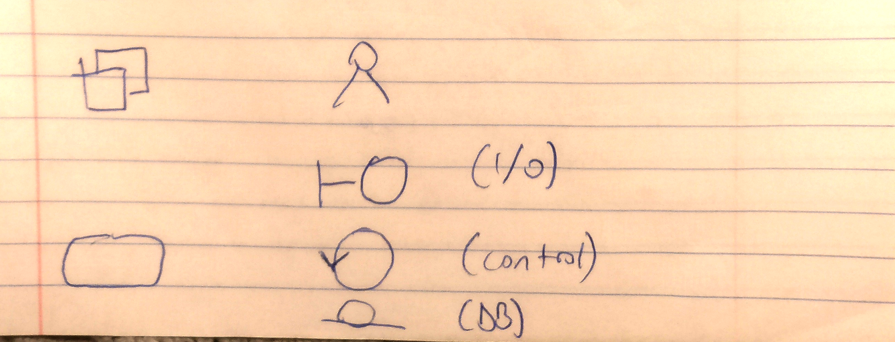
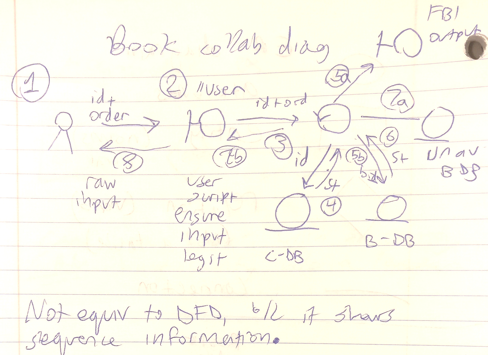
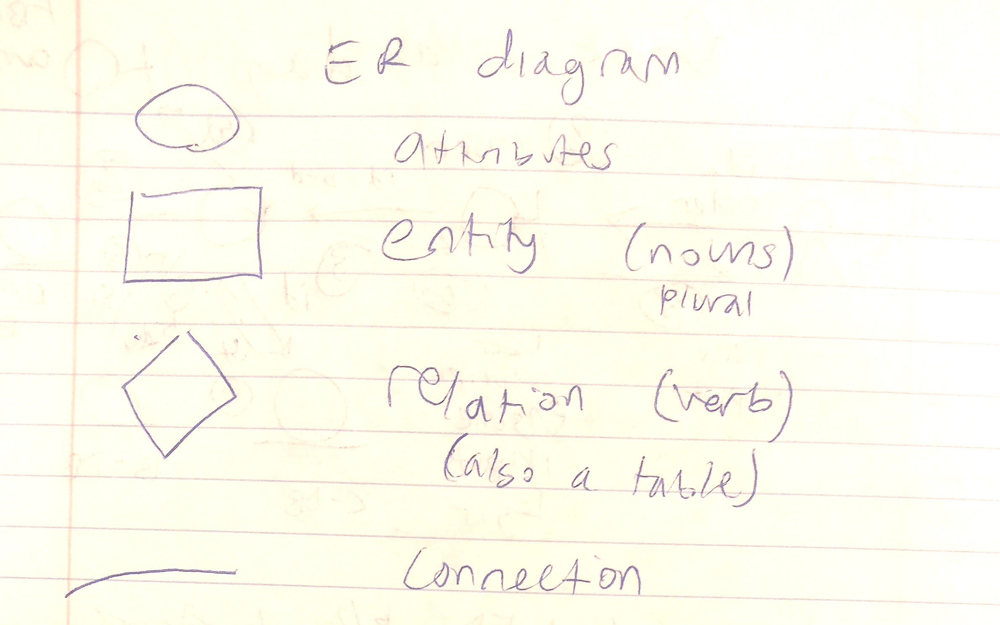
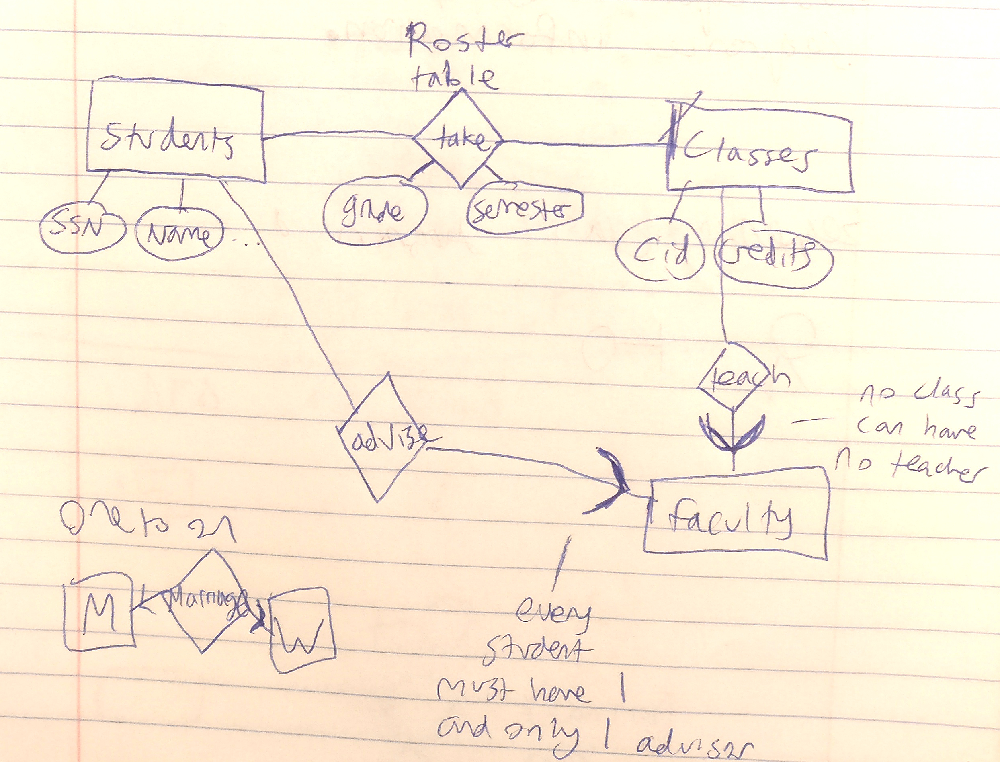
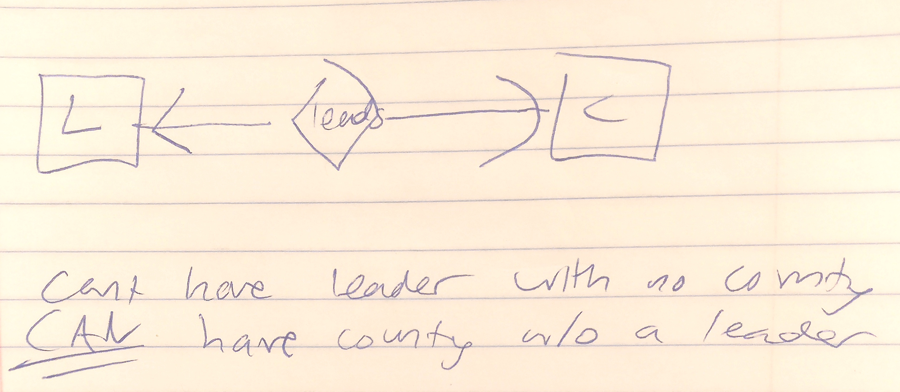

= Software Engineering
10/17/2018

== Efficient Power Function (Quiz)
Efficient power function:: Sublinear < O(n) +
a**n, a is constant, n variable

O(log n)

Power function very important today, used millions of times. Used in encryption (RSA) -- essentially the power function.

```
# handle base cases
if n == 0:
   return 1
elif a == 0 or a==1:
     return a
elif n < 0:
   return 1/e_pow(a, -n)

# backbone
if n % 2 == 0: #even
   tmp = e_pow(a, n/2)
   return tmp ** 2
else: #odd
   tmp = e_pow(a, (n-1)/2)
   return a * tmp ** 2
```

== Diagrams
=== Data Flow Diagram
* Used to be the king of all the diagrams. Some old timer programmers may ask question about bubble diagram (DFD).

// Add the pictures
.Data Flow Diagram Symbols
image::../pics/dfd_symbols.jpg[]

* DFD is hieararchical. Designed for CEO/high-level. Executive level chart without technical details.
* For a DFD to make sense to developers, you need to refine it. Add more Process blocks and details.
* DFD is not a part of UML any more. But, is the ancestor to the class diagram.
** Difference between DFD and class:
*** Everything is a class. Object oriented concepts. Has different symbols...

.DFD to Class Diagram Equivalent Symbols


.Bookstore Example
image::../pics/dfd_bookstore.png[]

=== Collaboration Diagram
Collaboration diagram:: DFD with class diagram notation.

.Bookstore in Collaboration Diagram


Sequence class diagram:: Equivalent to Collaborative diagram, but arranged differently. Put all classes in one row, drop down long bars from each symbol, and connect them with arrows appropriately.

Why bother having two different class diagrams? +
Which one do you prefer? +
* Sequence class is very clean, friendly to computers. Can be encoded as a matrix.
* Collaboration is more intuitive, messy, preferred by humans.

=== Entity-Relation Diagram (ER)
* Popular in Database design.
* Low level design must have logic/algorithm design (DFD/Col/Seq)
* Must also have data structure (DB and classes) design: ER diagram

.ER Diagram Symbols


Ex:
```
Class Student:
      int ssn
    string name
    string dept
    string dept_chair
    int address
    int phone
    string college
    string col_president
```

Judgement: is this class definition okay, or not? +
NO GOOD. We want to know just about students. Redundant information: you don't need to repeat the same chairman for every student instance. Not optimal definition.
* Space redundancy
* Update redundancy: Must be as atomic as possible to ensure consistency. If you have to update 1,000,000 records, it might fail part way through and leave your data in a bad state.

Remove redundancies and create separate classes:

```
class student:
      ...

class dept_chair:
      string dept
    string dept_chair

class col_pres:
      string college
      string col_president
```

Relation between student and d_c +
Relational database RDB, construct bridge/relation among DB.

.Student Roster Example in Diagram


.Nature of any relation
1 to 1:: draw a -> on both sides
1 to many:: draw a -> arrow
many to many:: draw => or plain edges.

rounded arrow:: 1 and only 1
angular arrow:: at most 1. Could be 0.

.ER Asymmetric Relationship (Leaders & Countries)

