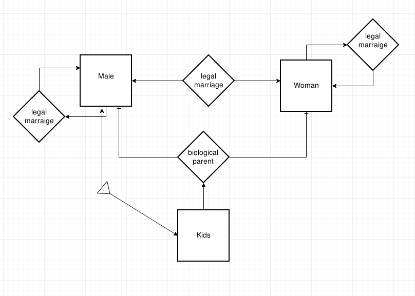

= Software Engineering
10/24/2018

== Charts to Know
. FSM
. E/R

== Entity Relation Diagrams

.Figure of relationships between mother, father, and child


E/R:: each entity is one table. +
each relation/diamond is one table.

Relational DB:: Want to reduce redundancies for storage and updating.

Ex 1 is inefficient because `Kids` table is redundant. We do not need Kids, because
they will grow up to become adult men and women over time.

Key/index of table/db:: A set of attributes that can uniquely identify a tuple/object.

.Example

```
Student:
  ssn, emplid (key), name, dept, address, college, birthday

```

`emplid` is the index that uniquely identifies student. Not every student is an
American citizen or has a social security number, so `ssn` is not good.

```
Roster / Take:
  ssn, cin, yr, semester, grade
```

As a database designer, we should not introduce any new information. Because, in the
real world, the data is already big. Don't add new data.

Do NOT add an artificial ID.

For Baseball database, if we cannot find any unique attributes, then it is a WEAK ENTITY.
Thus, we must borrow from the team (SUPPORT RELATION).

A WEAK ENTITY is a double rectangle.

A SUPPORT RELATION is a double diamond.

Arrow from `play` to `team` MUST be *rounded*. because of weak entity relation.

=== Functional Dependency
`A -> B`

`AB -> C`


For any two tuples in data files or DB, if they share the same value on the LHS of the FD,
then their values on the RHS must be the same.

=== 3rd Normal Form
Industry standard for any database or data structure definition.

For database or class, all non-key attributes are directly determined by the key.

Ex:: `ssn, name, dept, dept_name`

We have a hunch that this is no good. Why? With 3rd normal form, we have a theory.

key: ssn +
ssn -> name, +
ssn -> dept, +
dept -> dept_name

We have a functional dependency that is not directly determined by ssn.

This is NOT 3rd Normal Form.

=== 1st Normal Form
1. No repeated tuples. If it repeats, it is not a DB. it is a data WAREHOUSE.
2. Attributes must be atomic and typed. Int, String, and Float.


== The On-The-Fly Interview Problem

100 job candidates +
interview lasts one day.

How to make the decision about whom to hire? +


1st guy: Just say no, use them as learning sample. Remember their performance.
2nd guy: Much better than the first. Reject, and learn from them.
3rd guy: ...

When to stop learning? Problem is applicable to machine learning.

Two phases -- the learning phase, and decision phase. How to partition them?

Have too much learning is not good. Best place to stop learning is at `1/e` (~37% rule).
