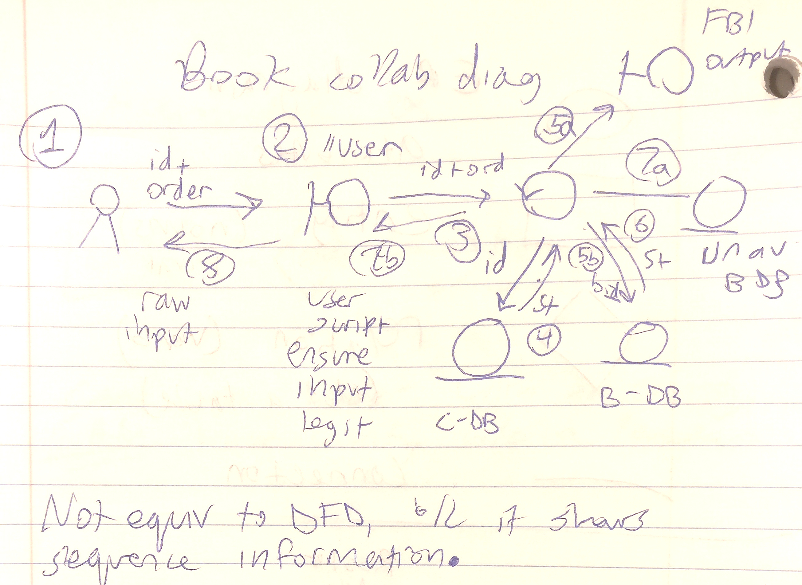
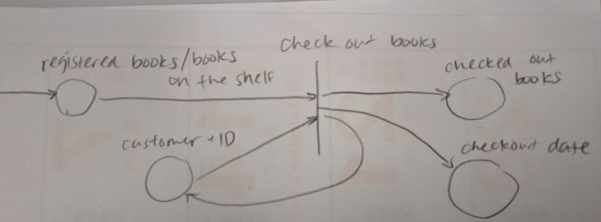

= Midterm: Study Sheet

IMPORTANT: Study everything from the quiz 1 study sheet including this.

NOTE: No FSM on exam BUT every other diagram may show up!

== 3 Types of Diagrams / Techniques
1. Formal : use math / logic to describe petri-net, FSM, State diagram +
  More difficult to write, complex -> not popular in industry
2. Informal : Natural language
3. Semi-formal : use-case diagram, E/R, pseudo-code

== Data Flow Diagram (DFD)

[.blue]*DFD Diagrams* illustrate how data flows through a system.

* Process
* Source/Destination
* Data file/DB
* Hierarchical
** For CEO/high-lvl ppl b/c without technical details

.Notation for DFD:
* Source/Destination: Multiple boxes
* Process: Rounded rectangle
* Datafile/Database: box open on right side
* Dataflow: Arrows with text to describe the data

....
Mini - amazon (m-a)
● Customers will put in book order and personal information
● m-a checks the criminal record/credit record of the customer
  ○ If wrong no service (CALL FBI, DODGE DODGE EVADE)
● m-a check DB/DW if book is available
  ○ If yes, cash return book
  ○ If no, feedback to order system
● If a book has many outstanding orders
  ○ m-a will order from publisher
....

== ER Diagram

Circle : Attributes

Rectangle : Entity (nouns)

Diamond : Relation (verb)

Line : Many to Many

Line with pointed arrow : Many to at most 1

Line with rounded arrow : Many to 1

=== Relational Database
Reduce redundancy

.Functional dependency
For a database, for any two tuples, if they share the same value present in the LHS, then the RHS should be the same

.Key or index
An attribute or set of attributes that uniquely determine one tuple

=== NF = Normal form (onion layers)

*1NF* = 1st normal form +
- No redundant tuples +
- All attributes are typed (low bar)

*2NF* = 2nd normal form +
- Allows transitive dependencies (A -> B, B -> C)

*3NF* = 3rd normal form +
- For all non-key attributes, they are directly determined by the key attribute(s)

*5NF* = 5th normal form +
- 2-attribute table +
- This is the dream database +
- However, this rarely happens

== Collaboration Diagram

  o     = Source
/   \

|--o = (1/0)

 o = database
---

Circle with arrow = control

== Sequence Class Diagram

Equivalent to Collaborative diagram, but arranged differently.
Put all classes in one row, drop down long bars from each symbol, and connect them with arrows appropriately.

== Collaborative vs Sequence

Which one do you prefer? +
* Sequence class is very clean, friendly to computers. Can be encoded as a matrix.
* Collaboration is more intuitive, messy, preferred by humans.

== Unified Modeling Language (UML)

[.blue]*UML Diagrams* describe the boundary, structure and the behavior of a system and the objects within it.
Benefits are: +
1. Scalable +
2. Secure +
3. Robust in execution

=== State Diagram
* Use rectangles
** initial rectangle
* Smart to have a catch all state
....
Draw a state diagram of a vending machine accepting 5, 10, 25 cents.
Goal : Get 30 cents
....

== Difference between State Diagram & FSM
1. Rectangles vs Circles
2. Long rectangle = initial/base state
3. State can handle loops / iteration

== Petri-Net
* Superset of FSM
* Equivalent to Turing Machine
* NOT UML

=== Components of petri-net
1. states, represented by circles
2. Tokens, represented by dots inside the circles
* Tokens are used to represent system resources
3. transition, represented by arrows →|→
* Input state(s) and output state(s)
* The transition can either be fired (there is a dynamic action) or blocked
** If the # of tokens in every input places/states >= the # of input legs, then the transition is fired
** If fired, we remove the tokens from the input places per # of input legs. We then add tokens to output places per # of output legs

NOTE: All transitions are AND Gates

=== Banker's Problem

There are 3 bankers sitting around a dinner table, given one chopstick each. They need 2 in order to eat. They are in a Deadlock

Deadlock : partial resources, but no one can proceed

Solve deadlock
Goal: Solve the deadlock and give everyone a chance to use the "chopsticks"
1. Queue-based Solution
  ■ Based on $$$/age/weight rank, use a priority queue
  ■ However, this is unfair to those at the back of the queue → discrimination
2. Use a fair policy--Time Sharing
  ■ Each banker is allotted x amount of time to eat, etc.
  ■ Initial ranking doesn't actually matter

.Example
....
Given one banker, if there are 3 chopsticks, that one banker takes a pair of chopsticks
  |
  v
The banker is able to eat (transition is fired)
  |
  v
After the banker finishes eating, the two chopsticks gets returned to the pool of resources

However, if there were 3 bankers, then there's a deadlock, and this cannot happen
....

=== Library

....
New books will be registered by a librarian and then put on bookshelf
....

....
All customers must provide ID to check out books
....

....
Returning books (3 actions which are OR)
a. Books returned before deadline are put back on the shelves
b. late returns (< 3 months) will be fined
c. late returns (> 3 months) will be reported to collection company
....

== Quickselect

.Algorithm
1. Randomly choose one anchor
2. Find the right position k +
  ○ If k is half of size A, we are done +
  ○ If k is > half, the anchor is > median. Search the prior array for the median +
  ○ If k is < half, the anchor is < median. Search the post array for the median with new ranking (n/2 - k)

.Time complexity of Quickselect
* n <= time complexity of quickselect <= O(n log n)
* Worst case: O(n 2 ), same as quicksort
* Best case: O(n)
* We are interested in the statistically average case: O(n)
